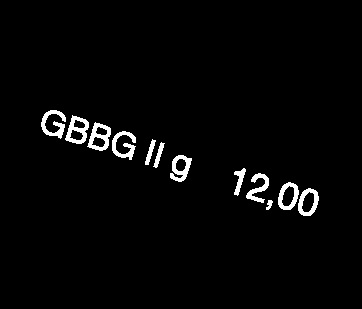
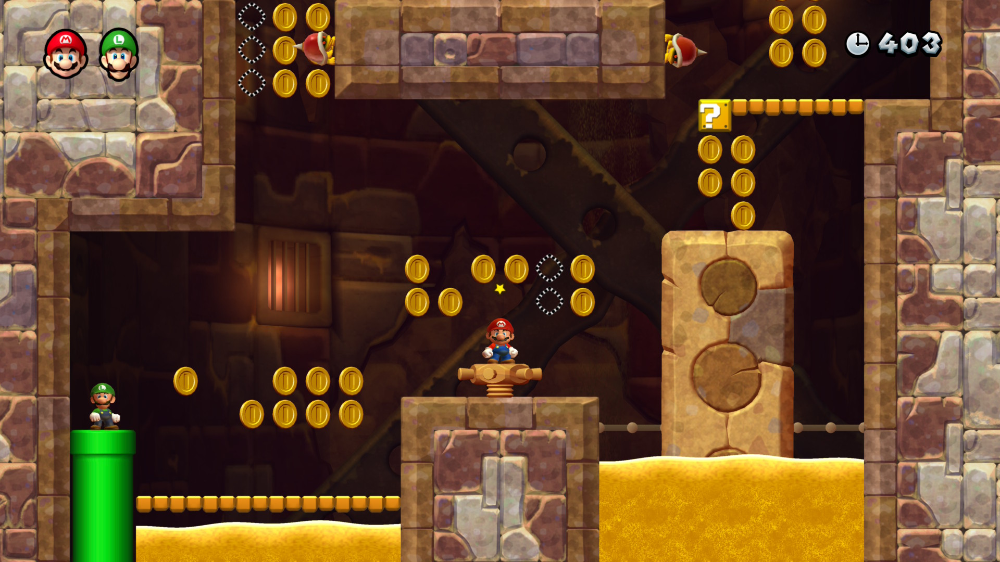

# Soft Computing Project

This repository contains three practical exercises for the course "Soft Computing," each focused on applying neural networks and image processing techniques to real-world problems. The exercises are organized into separate folders, each with its own dataset and implementation notebook.

---

## 1. OCR: Handwritten Text Recognition using ANN

**Folder:** `ocr/`

This exercise implements an Optical Character Recognition (OCR) pipeline for reading handwritten or printed text from images. The system:

- **Preprocess Images** – Convert to grayscale, deskew, binarize, and apply morphological operations (erode/dilate).
- **Segment Characters** – Detect contours and merge regions to isolate individual characters.
- **Train Neural Network** – Use a fully-connected Artificial Neural Network (ANN) on the segmented characters.
- **Predict and Evaluate** – Recognize text for each image and evaluate accuracy using a Hamming distance metric.

**Dataset:**

- Images and ground truth texts are listed in `data/texts.csv`.



---

## 2. Paw Patrol Bone Counter

**Folder:** `paw_patrol_bone_counter/`

This exercise focuses on detecting and counting bones in video frames using image processing. The pipeline:

- **Select Region of Interest (ROI)** – Identify the specific area in the image to process.
- **Apply Image Manipulation Techniques** – Perform preprocessing such as filtering, thresholding, or contrast adjustment.
- **Hough Transform for Circle Detection** – Use the Hough Circle Transform to detect circular features.

**Dataset:**

- Frame data and bone counts are stored in `data/count.csv`.


---

## 3. Super Mario Coin Counter

**Folder:** `super_mario_coin_counter/`

This exercise aims to detect and count coins in Super Mario game screenshots. The workflow includes:

- **Preprocess Images** – Enhance and highlight coins using techniques such as filtering, thresholding, or color masking.
- **Segment and Extract Coin Regions** – Identify individual coin regions from the background.
- **Count Coins and Apply Weights** – Count the detected coin regions and multiply by their corresponding values/weights to get the total score.

**Dataset:**

- Coin counts and values are in `data/coin_value_count.csv`.



---

## Getting Started

Each exercise contains a Jupyter notebook (`*.ipynb`) and a `requirements.txt` file listing dependencies. To run an exercise:

1. Navigate to the exercise folder (e.g., `ocr/`).
2. Install dependencies:

   ```bash
   pip install -r requirements.txt
   ```

3. Open the notebook in Jupyter or VS Code and run the cells.

---

## Project Structure

```text
README.md
ocr/
 ocr_ann.ipynb
 requirements.txt
 data/
  texts.csv
  sample_ocr_image.png
paw_patrol_bone_counter/
 bone_detection_video.ipynb
 requirements.txt
 data/
  count.csv
  sample_bone_frame.png
super_mario_coin_counter/
 coin_detection.ipynb
 requirements.txt
 data/
  coin_value_count.csv
  sample_coin_image.png
```

---

## Author

- [Luka Bradić](https://github.com/bruda04)
